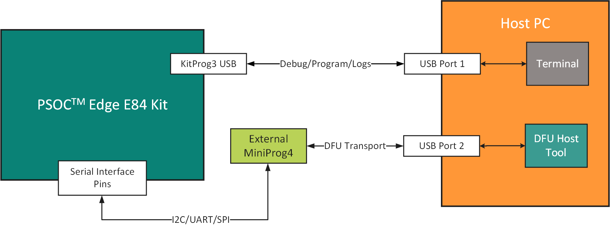
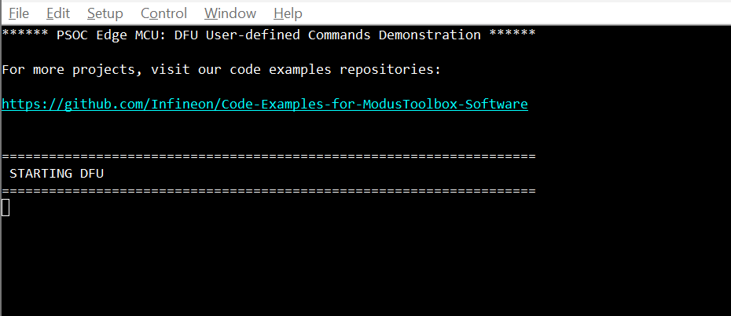
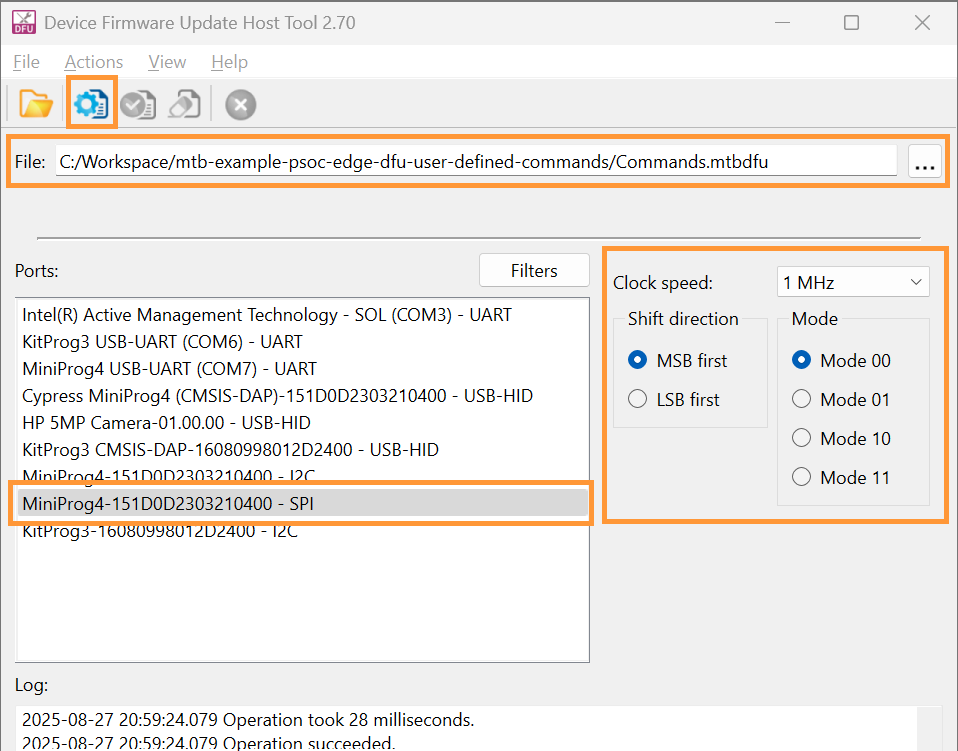
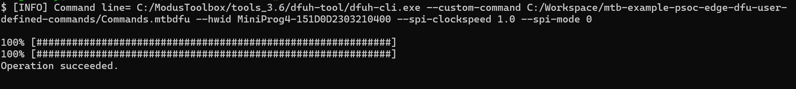
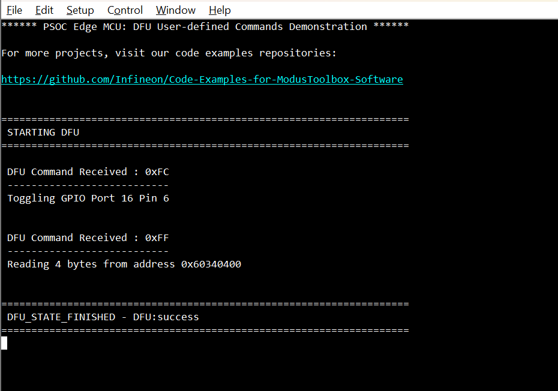
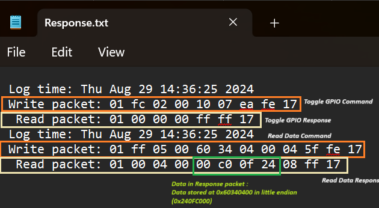

# PSOC&trade; Edge MCU: DFU user-defined commands

This code example demonstrates how to utilize Infineon's Device Firmware Update (DFU) middleware (MW) to send DFU user-defined commands over a serial interface, such as UART, SPI, or I2C. The host (typically a PC) running the DFU Host Tool establishes a connection to the target device and sends a series of user-defined commands to the device. Once the application receives the command, if the command belongs to the range of user-defined commands, the DFU MW calls the user-defined command handler registered by the application.

>**Note:** This code example only demonstrates the SPI interface for DFU. See other DFU code examples for different interfaces.

This code example has a three project structure: CM33 secure, CM33 non-secure, and CM55 projects. All three projects are programmed to the external QSPI flash and executed in Execute in Place (XIP) mode. Extended boot launches the CM33 secure project from a fixed location in the external flash, which then configures the protection settings and launches the CM33 non-secure application, which is responsible for DFU operations. Additionally, CM33 non-secure application enables CM55 CPU and launches the CM55 application.

[View this README on GitHub.](https://github.com/Infineon/mtb-example-psoc-edge-dfu-user-defined-commands)

[Provide feedback on this code example.](https://cypress.co1.qualtrics.com/jfe/form/SV_1NTns53sK2yiljn?Q_EED=eyJVbmlxdWUgRG9jIElkIjoiQ0UyNDA0MzciLCJTcGVjIE51bWJlciI6IjAwMi00MDQzNyIsIkRvYyBUaXRsZSI6IlBTT0MmdHJhZGU7IEVkZ2UgTUNVOiBERlUgdXNlci1kZWZpbmVkIGNvbW1hbmRzIiwicmlkIjoibWFuYW4gamFpbiIsIkRvYyB2ZXJzaW9uIjoiMi4wLjAiLCJEb2MgTGFuZ3VhZ2UiOiJFbmdsaXNoIiwiRG9jIERpdmlzaW9uIjoiTUNEIiwiRG9jIEJVIjoiSUNXIiwiRG9jIEZhbWlseSI6IlBTT0MifQ==)

See the [Design and implementation](docs/design_and_implementation.md) for the functional description of this code example.


## Requirements

- [ModusToolbox&trade;](https://www.infineon.com/modustoolbox) v3.6 or later (tested with v3.6)
- Board support package (BSP) minimum required version: 1.0.0
- Programming language: C
- Associated parts: All [PSOC&trade; Edge MCU](https://www.infineon.com/products/microcontroller/32-bit-psoc-arm-cortex/32-bit-psoc-edge-arm) parts


## Supported toolchains (make variable 'TOOLCHAIN')

- GNU Arm&reg; Embedded Compiler v14.2.1 (`GCC_ARM`) – Default value of `TOOLCHAIN`
- Arm&reg; Compiler v6.22 (`ARM`)
- IAR C/C++ Compiler v9.50.2 (`IAR`)
- LLVM Embedded Toolchain for Arm&reg; v19.1.5 (`LLVM_ARM`)


## Supported kits (make variable 'TARGET')

- [PSOC&trade; Edge E84 Evaluation Kit](https://www.infineon.com/KIT_PSE84_EVAL) (`KIT_PSE84_EVAL_EPC2`) – Default value of `TARGET`
- [PSOC&trade; Edge E84 Evaluation Kit](https://www.infineon.com/KIT_PSE84_EVAL) (`KIT_PSE84_EVAL_EPC4`)


## Hardware setup

This example uses the board's default configuration. See the kit user guide to ensure that the board is configured correctly.

1. Ensure the following jumper and pin configurations on the board:
    - Boot SW Pin (P17.6) is in the HIGH/ON position
    - J20 and J21 is in the tristate/not connected (NC) position

2. **Serial communication pin connections** <br>
   This CE uses SPI DFU transport by default; make the following connections required for SPI interface:

    - Connect SERIAL_INT3 PIN on EVK to SCLK (Pin 3) of MiniProg4
    - Connect SERIAL_INT2 PIN on EVK to MOSI (Pin 7) of MiniProg4
    - Connect SERIAL_INT1 PIN on EVK to MISO (Pin 9) of MiniProg4
    - Connect SERIAL_INT0 PIN on EVK to SS (Pin 5) of MiniProg4
    - Make the required VDD (1.8 V) and GND connections 

    **Table 1** and **Figure 1** provide details on how to make the connections if you want to use another interface. This example uses SPI as the default interface

    **Figure 1. Sample interface connection**

    

    **Table 1 : Serial interface connection**
    
     Interface | Signal (MiniProg4 pins) | EVK pins
    ---------- | ----------------------- | --------
    UART       | RX <br> TX              | SERIAL_INT3 <br> SERIAL_INT2
    I2C        | SCL <br> SDA            | SERIAL_INT3 <br> SERIAL_INT2
    SPI | MOSI <br> SCLK <br> SS <br> MISO | SERIAL_INT2 <br> SERIAL_INT3 <br> SERIAL_INT0 <br> SERIAL_INT1

<br>

3. Connect KitProg3 (on-board EVK) to the PC.

    While both KitProg3 and MiniProg4 (external) has to be connected to the PC. However, do not connect the MiniProg4 USB to the host PC just yet – until you are instructed to do so later in this README.
    
     The following figure shows the sample harware connection required for the example:

    **Figure 2. Sample hardware connection**

    


## Software setup

See the [ModusToolbox&trade; tools package installation guide](https://www.infineon.com/ModusToolboxInstallguide) for information about installing and configuring the tools package.

Install a terminal emulator if you do not have one. Instructions in this document use [Tera Term](https://teratermproject.github.io/index-en.html).

This example requires no additional software or tools.


## Operation

See [Using the code example](docs/using_the_code_example.md) for instructions on creating a project, opening it in various supported IDEs, and performing tasks, such as building, programming, and debugging the application within the respective IDEs.

1. Connect the board to your PC using the provided USB cable through the KitProg3 USB connector

2. Open a terminal program and select the KitProg3 COM port. Set the serial port parameters to 8N1 and 115200 baud

3. After programming, the application starts automatically. Confirm that "PSOC Edge MCU: DFU User-defined Commands Demonstration" is displayed on the UART terminal

   **Figure 1. Terminal output on program startup**

    

4. Confirm that the kit User LED1 blinks at approximately 1 Hz. This means that the application is booted successfully and ready to receive DFU commands. Refer below steps to perform DFU operations.

    1. Ensure instructions in [**Hardware Setup**](#hardware-setup) section are followed and connect the MinProg4 USB to the PC

    2. Send commands to the device using either the DFU Host Tool GUI or CLI:

        <details><summary><b>Using DFU Host Tool GUI</b></summary>

        1. Open *dfuh-tool.exe* located at *[install-path]/ModusToolbox/tools_3.6/dfuh-tool*
        2. Select *Workspace/[CodeExampleName]/Commands.mtbdfu* as the input file to the DFU host tool
        3. Select the SPI interface and update the configuration as per the [Serial Interface Configuration](docs/design_and_implementation.md#serial-interface-configuration) section in **Design and Implementation**
        4. Click on the **Execute** button; see **Figure 3** for reference

            **Figure 3. DFU Host Tool GUI**

            

        </details>

        <details><summary><b>Using DFU Host Tool CLI</b></summary>

        1. Open the modus-shell terminal and move to DFU Host Tool directory (*[install-path]/ModusToolbox/tools_3.6/dfuh-tool*)
        2. Execute the following DFU CLI command from the Host Tool directory in the shell terminal:

            ```
            dfuh-cli.exe --custom-command path-to-mtbdfu-file --hwid Probe-id/COM Port  --interface-params 
            ```

            For example, to use SPI interface, use:

            ```
            dfuh-cli.exe --custom-command  `<Workspace>/<CodeExampleName>`/Commands.mtbdfu --hwid MiniProg4-151D0D2303210400 --spi-clockspeed 1.0 --spi-mode 0
            ```

            **Figure 4. Console output of DFU Host Tool CLI**

            

            > **Note:** 
            > 1. The command above is given for the default Interface (SPI) configurations, change the command as required for other interface/configurations
            > 2. See [DFU Host Tool for ModusToolbox User Guide](https://www.infineon.com/ModusToolboxDFUHostTool) for details

        </details>

    3. See **Figure 5** for the terminal output of the custom commands execution

        - **First command (0xFC):** The device toggles `GPIO 10.6`, which is connected to User LED2 on PSOC&trade; Edge EVK. Check that LED2 is turned on if it was off before the command execution
        - **Second command (0xFF):** The device reads `4` bytes from address `0x60340400` and sends it as a response back to the tool. DFU Host tool can not display the response received, but the response is captured (elaborated in the following step)

        **Figure 5. Terminal output of command execution**

        

   4. Custom commands response received by the DFU Host Tool is captured as per the command in *[install-path]/ModusToolbox/tools_3.6/dfuh-tool/Response.txt* file. **Figure 6** shows the response for the above commands sent to the device
        
        To change the response capture file name and path, update the `outFile` field in the *Commands.mtbdfu* file for each command

        **Figure 6. Device response captured by the Host Tool for custom commands**

        


## Related resources

Resources  | Links
-----------|----------------------------------
Application notes  | [AN235935](https://www.infineon.com/AN235935) – Getting started with PSOC&trade; Edge E8 MCU on ModusToolbox&trade; software
Code examples  | [Using ModusToolbox&trade;](https://github.com/Infineon/Code-Examples-for-ModusToolbox-Software) on GitHub
Device documentation | [PSOC&trade; Edge MCU datasheet](https://www.infineon.com/products/microcontroller/32-bit-psoc-arm-cortex/32-bit-psoc-edge-arm#documents) <br> [PSOC&trade; Edge MCU reference manuals](https://www.infineon.com/products/microcontroller/32-bit-psoc-arm-cortex/32-bit-psoc-edge-arm#documents)
Development kits | Select your kits from the [Evaluation board finder](https://www.infineon.com/cms/en/design-support/finder-selection-tools/product-finder/evaluation-board)
Libraries  | [mtb-dsl-pse8xxgp](https://github.com/Infineon/mtb-dsl-pse8xxgp) – Device support library for PSE8XXGP <br> [retarget-io](https://github.com/Infineon/retarget-io) – Utility library to retarget STDIO messages to a UART port <br> [DFU](https://github.com/Infineon/dfu) – Device Firmware Update Middleware (DFU MW)
Tools  | [ModusToolbox&trade;](https://www.infineon.com/modustoolbox) – ModusToolbox&trade; software is a collection of easy-to-use libraries and tools enabling rapid development with Infineon MCUs for applications ranging from wireless and cloud-connected systems, edge AI/ML, embedded sense and control, to wired USB connectivity using PSOC&trade; Industrial/IoT MCUs, AIROC&trade; Wi-Fi and Bluetooth&reg; connectivity devices, XMC&trade; Industrial MCUs, and EZ-USB&trade;/EZ-PD&trade; wired connectivity controllers. ModusToolbox&trade; incorporates a comprehensive set of BSPs, HAL, libraries, configuration tools, and provides support for industry-standard IDEs to fast-track your embedded application development

<br>


## Other resources

Infineon provides a wealth of data at [www.infineon.com](https://www.infineon.com) to help you select the right device, and quickly and effectively integrate it into your design.


## Document history

Document title: *CE240437* – *PSOC&trade; Edge MCU: DFU user-defined commands*

 Version | Description of change
 ------- | ---------------------
 1.x.0   | New code example <br> Early access release
 2.0.0   | GitHub release
<br>


All referenced product or service names and trademarks are the property of their respective owners.

The Bluetooth&reg; word mark and logos are registered trademarks owned by Bluetooth SIG, Inc., and any use of such marks by Infineon is under license.

PSOC&trade;, formerly known as PSoC&trade;, is a trademark of Infineon Technologies. Any references to PSoC&trade; in this document or others shall be deemed to refer to PSOC&trade;.

---------------------------------------------------------

© Cypress Semiconductor Corporation, 2023-2025. This document is the property of Cypress Semiconductor Corporation, an Infineon Technologies company, and its affiliates ("Cypress").  This document, including any software or firmware included or referenced in this document ("Software"), is owned by Cypress under the intellectual property laws and treaties of the United States and other countries worldwide.  Cypress reserves all rights under such laws and treaties and does not, except as specifically stated in this paragraph, grant any license under its patents, copyrights, trademarks, or other intellectual property rights.  If the Software is not accompanied by a license agreement and you do not otherwise have a written agreement with Cypress governing the use of the Software, then Cypress hereby grants you a personal, non-exclusive, nontransferable license (without the right to sublicense) (1) under its copyright rights in the Software (a) for Software provided in source code form, to modify and reproduce the Software solely for use with Cypress hardware products, only internally within your organization, and (b) to distribute the Software in binary code form externally to end users (either directly or indirectly through resellers and distributors), solely for use on Cypress hardware product units, and (2) under those claims of Cypress's patents that are infringed by the Software (as provided by Cypress, unmodified) to make, use, distribute, and import the Software solely for use with Cypress hardware products.  Any other use, reproduction, modification, translation, or compilation of the Software is prohibited.
<br>
TO THE EXTENT PERMITTED BY APPLICABLE LAW, CYPRESS MAKES NO WARRANTY OF ANY KIND, EXPRESS OR IMPLIED, WITH REGARD TO THIS DOCUMENT OR ANY SOFTWARE OR ACCOMPANYING HARDWARE, INCLUDING, BUT NOT LIMITED TO, THE IMPLIED WARRANTIES OF MERCHANTABILITY AND FITNESS FOR A PARTICULAR PURPOSE.  No computing device can be absolutely secure.  Therefore, despite security measures implemented in Cypress hardware or software products, Cypress shall have no liability arising out of any security breach, such as unauthorized access to or use of a Cypress product. CYPRESS DOES NOT REPRESENT, WARRANT, OR GUARANTEE THAT CYPRESS PRODUCTS, OR SYSTEMS CREATED USING CYPRESS PRODUCTS, WILL BE FREE FROM CORRUPTION, ATTACK, VIRUSES, INTERFERENCE, HACKING, DATA LOSS OR THEFT, OR OTHER SECURITY INTRUSION (collectively, "Security Breach").  Cypress disclaims any liability relating to any Security Breach, and you shall and hereby do release Cypress from any claim, damage, or other liability arising from any Security Breach.  In addition, the products described in these materials may contain design defects or errors known as errata which may cause the product to deviate from published specifications. To the extent permitted by applicable law, Cypress reserves the right to make changes to this document without further notice. Cypress does not assume any liability arising out of the application or use of any product or circuit described in this document. Any information provided in this document, including any sample design information or programming code, is provided only for reference purposes.  It is the responsibility of the user of this document to properly design, program, and test the functionality and safety of any application made of this information and any resulting product.  "High-Risk Device" means any device or system whose failure could cause personal injury, death, or property damage.  Examples of High-Risk Devices are weapons, nuclear installations, surgical implants, and other medical devices.  "Critical Component" means any component of a High-Risk Device whose failure to perform can be reasonably expected to cause, directly or indirectly, the failure of the High-Risk Device, or to affect its safety or effectiveness.  Cypress is not liable, in whole or in part, and you shall and hereby do release Cypress from any claim, damage, or other liability arising from any use of a Cypress product as a Critical Component in a High-Risk Device. You shall indemnify and hold Cypress, including its affiliates, and its directors, officers, employees, agents, distributors, and assigns harmless from and against all claims, costs, damages, and expenses, arising out of any claim, including claims for product liability, personal injury or death, or property damage arising from any use of a Cypress product as a Critical Component in a High-Risk Device. Cypress products are not intended or authorized for use as a Critical Component in any High-Risk Device except to the limited extent that (i) Cypress's published data sheet for the product explicitly states Cypress has qualified the product for use in a specific High-Risk Device, or (ii) Cypress has given you advance written authorization to use the product as a Critical Component in the specific High-Risk Device and you have signed a separate indemnification agreement.
<br>
Cypress, the Cypress logo, and combinations thereof, ModusToolbox, PSoC, CAPSENSE, EZ-USB, F-RAM, and TRAVEO are trademarks or registered trademarks of Cypress or a subsidiary of Cypress in the United States or in other countries. For a more complete list of Cypress trademarks, visit www.infineon.com. Other names and brands may be claimed as property of their respective owners.
